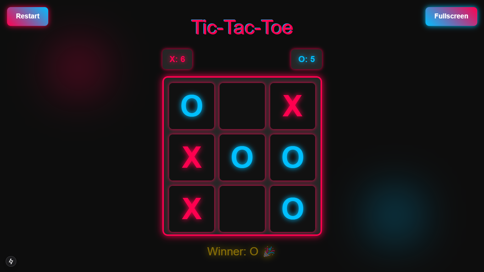
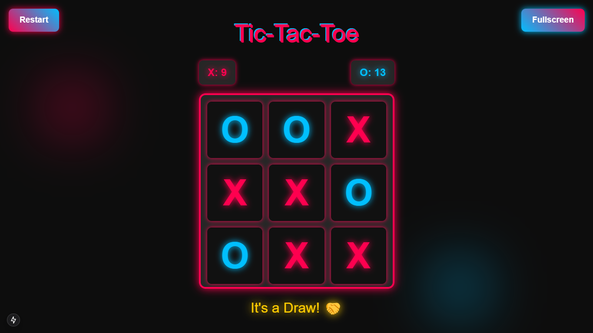

# Tic-Tac-Win 🎮

Welcome to **Tic-Tac-Win**! A modern and visually stunning take on the classic Tic-Tac-Toe game. Built with **React**, **Next.js**, and **Tailwind CSS**, this project offers a sleek and interactive gaming experience with cool animations and effects. Whether you're a fan of the classic game or just looking for a fun project to explore, Tic-Tac-Win has something for everyone!

---

## Features ✨

- Play as **X** or **O** 🅾️❌
- Real-time score tracking
- Winner announcement with animated effects 🎉
- Fullscreen mode for a better experience 🖥️
- Draw condition detection 🤝
- Beautiful glowing animations ✨


## Screenshots 📸
| O wins | Draw |
|:---:|:---:|
|  | |


---

## How to Play 🕹️

1. **Start the Game**: Open the app and click on any grid cell to place your **X** or **O**.
2. **Win the Game**: Be the first to get three of your symbols in a row (horizontally, vertically, or diagonally).
3. **Reset the Game**: Click the **Restart** button to reset the grid and start a new game.
4. **Go Fullscreen**: Click the **Fullscreen** button to immerse yourself in the game.

---

## Installation 🛠️

To run this project locally, follow these steps:

1. **Clone the Repository**:
   ```bash
   git clone https://github.com/MYounesEG/Tic-Tac-Win.git
   cd tic-tac-win
   ```

2. **Install Dependencies**:
   ```bash
    npm install
   ```

3. **Run the Development Server**:
    ```bash
    npm run dev
    ```

4. **Open in Browser**:

    Visit `http://localhost:3000` to play the game.

## Technologies Used 💻

- **React**: For building the interactive UI.

- **Next.js**: For server-side rendering and routing.

- **Tailwind CSS**: For styling and responsive design.

- **TypeScript**: For type-safe development.

- **CSS Animations**: For smooth and engaging visuals.


## Enjoy the Game! 🕹️🎉